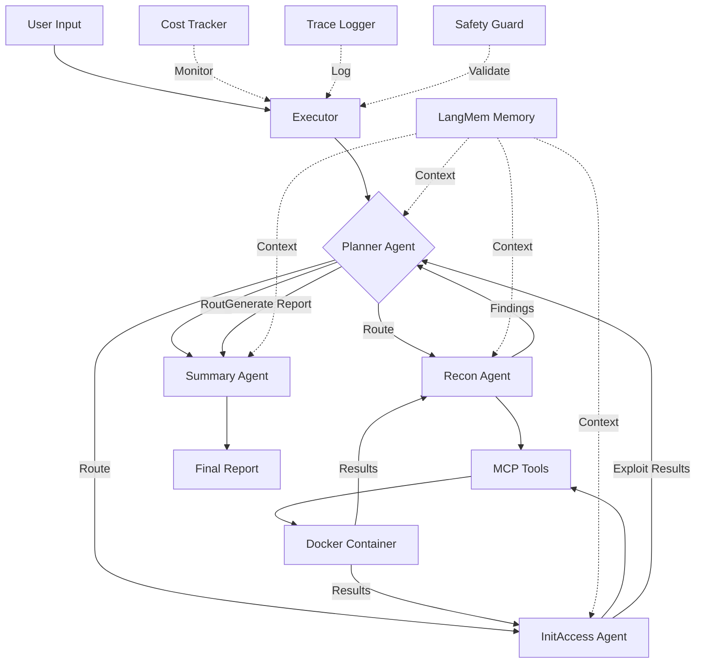

# AI Red Teaming Multi-Agent System - Architecture Documentation

## Table of Contents
1. [System Overview](#system-overview)
2. [Multi-Agent Architecture Rationale](#multi-agent-architecture-rationale)
3. [Agent Roles and Responsibilities](#agent-roles-and-responsibilities)
4. [Memory and State Management](#memory-and-state-management)
5. [Tool Integration Strategy](#tool-integration-strategy)
6. [Workflow Orchestration](#workflow-orchestration)
7. [Design Decisions](#design-decisions)
8. [Performance Considerations](#performance-considerations)

---

## System Overview

The AI Red Teaming Multi-Agent System is an autonomous penetration testing framework that leverages multiple specialized AI agents coordinated through LangGraph. The system automates reconnaissance, vulnerability identification, and exploit planning phases of security assessments.

### High-Level Architecture

```
┌─────────────────────────────────────────────────────────────────┐
│                     User Interface (Streamlit)                   │
│                  Human-in-the-Loop Approval UI                   │
└────────────────────────────┬────────────────────────────────────┘
                             │
                             ▼
┌─────────────────────────────────────────────────────────────────┐
│                    Workflow Executor                             │
│  • Cost Tracking  • Trace Logging  • Safety Guards              │
└────────────────────────────┬────────────────────────────────────┘
                             │
                             ▼
┌─────────────────────────────────────────────────────────────────┐
│                   LangGraph Swarm Coordinator                    │
│              (State Management & Agent Routing)                  │
└─┬───────────┬─────────────┬─────────────┬────────────────────┬──┘
  │           │             │             │                    │
  ▼           ▼             ▼             ▼                    ▼
┌───────┐ ┌────────┐ ┌─────────────┐ ┌─────────┐       ┌─────────┐
│Planner│ │ Recon  │ │ InitAccess  │ │ Summary │       │ Memory  │
│ Agent │ │ Agent  │ │   Agent     │ │  Agent  │       │(LangMem)│
└───┬───┘ └───┬────┘ └──────┬──────┘ └────┬────┘       └────┬────┘
    │         │             │             │                  │
    │         │             │             │                  │
    └─────────┴─────────────┴─────────────┴──────────────────┘
                             │
                             ▼
┌─────────────────────────────────────────────────────────────────┐
│                    MCP Tool Servers (36+ Tools)                  │
│  ┌─────────┐  ┌──────┐  ┌────────┐  ┌───────┐  ┌────────┐     │
│  │  nmap   │  │nuclei│  │ hydra  │  │sqlmap │  │msfconsole│    │
│  └─────────┘  └──────┘  └────────┘  └───────┘  └────────┘     │
│                    + 31 more tools...                            │
└─────────────────────────────────────────────────────────────────┘
                             │
                             ▼
┌─────────────────────────────────────────────────────────────────┐
│                Docker Container (Kali Linux)                     │
│              Isolated Execution Environment                      │
└─────────────────────────────────────────────────────────────────┘
```

---

## Multi-Agent Architecture Rationale

### Why Multi-Agent vs Single Agent?

**Decision: Multi-Agent Architecture**

#### Advantages of Multi-Agent Approach:

1. **Specialization**
   - Each agent focuses on a specific phase of penetration testing
   - Specialized prompts and knowledge for domain expertise
   - Better performance than generalist single agent

2. **Modularity**
   - Agents can be updated/replaced independently
   - Easy to add new agents for additional capabilities
   - Cleaner separation of concerns

3. **Parallel Execution Potential**
   - Multiple reconnaissance tools can run concurrently
   - Better resource utilization
   - Faster overall execution

4. **State Isolation**
   - Each agent maintains its own context
   - Reduces token usage per agent
   - Prevents context mixing between phases

5. **Debugging and Observability**
   - Clear attribution of decisions to specific agents
   - Easier to trace failures to specific components
   - Better logging and monitoring

#### Trade-offs Considered:

| Aspect | Single Agent | Multi-Agent (Chosen) |
|--------|-------------|---------------------|
| Complexity | Lower | Higher coordination needed |
| Token Usage | Higher (long context) | Lower (distributed) |
| Specialization | Generalist | Experts per domain |
| Maintainability | Simpler | Modular, easier updates |
| Observability | Single trace | Multi-agent attribution |
| **Overall Fit** | Poor for complex workflows | **Excellent** ✓ |

---

## Agent Roles and Responsibilities

### 1. Planner Agent

**Role:** Strategic coordinator and task decomposition

**Responsibilities:**
- Parse user objectives into actionable tasks
- Decompose complex goals into step-by-step plans
- Route tasks to appropriate specialist agents
- Track overall progress and adjust strategy
- Identify when sufficient information is gathered

**Key Capabilities:**
- Task prioritization
- Agent handoff decisions
- Progress tracking
- Strategy adaptation

**Example Output:**
```
Plan for reconnaissance of 192.168.1.100:
1. Network discovery (→ Recon Agent)
2. Port scanning (→ Recon Agent)
3. Service enumeration (→ Recon Agent)
4. Vulnerability assessment (→ Recon Agent)
5. Exploit planning (→ InitAccess Agent)
```

---

### 2. Reconnaissance Agent

**Role:** Information gathering and intelligence collection

**Responsibilities:**
- Network discovery and port scanning
- Service version detection
- Web application enumeration
- DNS reconnaissance
- OSINT gathering
- Technology fingerprinting

**Tools Used:**
- `nmap`, `masscan` - Network scanning
- `nuclei` - Vulnerability scanning
- `dig`, `whois` - DNS/WHOIS lookups
- `dirb`, `gobuster` - Directory enumeration
- `nikto`, `wpscan` - Web scanning

**State Tracking:**
- Discovered hosts and services
- Open ports and versions
- Potential vulnerabilities
- Technology stack information

**Example Workflow:**
```python
1. Run nmap for initial port scan
2. Detect web server on port 80/443
3. Run nuclei for vulnerability scanning
4. Enumerate directories with gobuster
5. Return findings to Planner
```

---

### 3. Initial Access Agent

**Role:** Exploit planning and credential attacks

**Responsibilities:**
- Analyze reconnaissance findings
- Identify viable attack vectors
- Plan exploitation strategies
- Credential brute-forcing (when authorized)
- SQL injection testing
- Generate Metasploit payloads

**Tools Used:**
- `msfconsole` - Metasploit framework
- `msfvenom` - Payload generation
- `hydra`, `medusa` - Credential attacks
- `sqlmap` - SQL injection
- `john`, `hashcat` - Password cracking

**Safety Features:**
- **Human-in-the-loop required** for exploitation
- Target validation checks
- Authorization verification
- Detailed logging of attempts

**Example Workflow:**
```python
1. Receive vulnerability list from Recon Agent
2. Prioritize exploitable vulnerabilities
3. Request human approval for exploitation
4. Generate exploit payload
5. Report results to Summary Agent
```

---

### 4. Summary Agent

**Role:** Report generation and findings aggregation

**Responsibilities:**
- Consolidate findings from all agents
- Generate structured reports
- Prioritize vulnerabilities by severity
- Provide remediation recommendations
- Create executive summaries

**Output Formats:**
- Executive summary (high-level)
- Technical detailed report
- Vulnerability matrix
- Risk scoring
- Remediation roadmap

**Example Report Structure:**
```markdown
# Penetration Test Summary

## Executive Summary
- Target: 192.168.1.100
- Duration: 45 minutes
- Critical: 2, High: 5, Medium: 8

## Critical Findings
1. SQL Injection (CVSS 9.8)
   - Location: /login.php
   - Recommendation: Input validation

## Detailed Findings
[Technical details...]
```

---

## Memory and State Management

### LangGraph State Schema

```python
class SwarmState(TypedDict):
    """Shared state across all agents"""
    
    # User input
    messages: List[BaseMessage]
    
    # Current context
    current_agent: str
    task_description: str
    
    # Agent outputs
    planner_output: Optional[str]
    recon_findings: Optional[Dict]
    exploit_results: Optional[Dict]
    summary_report: Optional[str]
    
    # Workflow control
    next_agent: Optional[str]
    should_continue: bool
    iteration_count: int
```

### Memory System: LangMem

**Architecture:**
```
┌─────────────────────────────────────────┐
│         LangMem Memory System           │
├─────────────────────────────────────────┤
│  • Vector Store (OpenAI Embeddings)     │
│  • Conversation History                 │
│  • Tool Execution Results               │
│  • Agent Interaction Log                │
└─────────────────────────────────────────┘
```

**Key Features:**
1. **Vector Search** - Semantic retrieval of past findings
2. **Conversation Context** - Full dialogue history
3. **Cross-Session Memory** - Persistent across runs
4. **Tool Result Caching** - Avoid redundant scans

**Usage Pattern:**
```python
# Store finding
memory.add_memory({
    "type": "vulnerability",
    "target": "192.168.1.100",
    "finding": "SQL injection on /login.php",
    "severity": "critical"
})

# Retrieve relevant context
relevant = memory.search("SQL injection previous findings")
```

### InMemorySaver Checkpointer

**Purpose:** Workflow state persistence and recovery

**Benefits:**
- Resume interrupted workflows
- Rollback to previous states
- Debug agent decision points
- Replay conversations

---

## Tool Integration Strategy

### MCP (Model Context Protocol) Architecture

**Why MCP?**
- Standardized tool interface
- Type-safe tool definitions
- Automatic schema validation
- Remote execution support

### Tool Organization

**36+ Penetration Testing Tools:**

```
┌─────────────────────────────────────────────────────┐
│              MCP Server Architecture                │
├─────────────────────────────────────────────────────┤
│                                                     │
│  ┌─────────────────────────────────────────────┐  │
│  │    Network Scanners (6 tools)               │  │
│  │  nmap, masscan, unicornscan, hping3, etc.  │  │
│  └─────────────────────────────────────────────┘  │
│                                                     │
│  ┌─────────────────────────────────────────────┐  │
│  │    Vulnerability Scanners (5 tools)         │  │
│  │  nuclei, nikto, wpscan, joomscan, etc.     │  │
│  └─────────────────────────────────────────────┘  │
│                                                     │
│  ┌─────────────────────────────────────────────┐  │
│  │    Exploitation Tools (8 tools)             │  │
│  │  msfconsole, msfvenom, sqlmap, etc.        │  │
│  └─────────────────────────────────────────────┘  │
│                                                     │
│  ┌─────────────────────────────────────────────┐  │
│  │    Credential Tools (7 tools)               │  │
│  │  hydra, medusa, john, hashcat, etc.        │  │
│  └─────────────────────────────────────────────┘  │
│                                                     │
│  ┌─────────────────────────────────────────────┐  │
│  │    Enumeration Tools (10 tools)             │  │
│  │  gobuster, dirb, enum4linux, etc.          │  │
│  └─────────────────────────────────────────────┘  │
│                                                     │
└─────────────────────────────────────────────────────┘
```

### Reliability Wrapper

All tools wrapped with:
- **Timeouts** (60s-600s based on tool)
- **Retries** (1-3 attempts with exponential backoff)
- **Circuit Breakers** (prevent cascading failures)
- **Output Validation** (schema checks, sanitization)

### Docker Isolation

**Execution Environment:**
```dockerfile
FROM kalilinux/kali-rolling

# All tools run in isolated container
# Network segmentation
# Resource limits enforced
```

**Benefits:**
- Security isolation
- Reproducible environment
- Easy deployment
- Resource control

---

## Workflow Orchestration

### LangGraph Workflow Design

```python
def create_dynamic_swarm():
    """
    Workflow Steps:
    1. User Input → Planner Agent
    2. Planner → Route to specialist agents
    3. Specialists → Execute and report back
    4. Summary Agent → Generate final report
    """
    
    workflow = StateGraph(SwarmState)
    
    # Add agent nodes
    workflow.add_node("planner", planner_node)
    workflow.add_node("recon", recon_node)
    workflow.add_node("init_access", init_access_node)
    workflow.add_node("summary", summary_node)
    
    # Define routing logic
    workflow.add_conditional_edges(
        "planner",
        route_to_next_agent,  # Decision function
        {
            "recon": "recon",
            "init_access": "init_access",
            "summary": "summary",
            "end": END
        }
    )
    
    return workflow.compile()
```

### Agent Handoff Mechanism

**Handoff Pattern:**
```python
# Agent completes task and hands off
return {
    "messages": [...],
    "next_agent": "recon",  # Route to Recon Agent
    "should_continue": True,
    "recon_findings": {...}
}
```

**Routing Logic:**
```python
def route_to_next_agent(state: SwarmState) -> str:
    """Intelligent routing based on state"""
    
    if state["current_agent"] == "planner":
        if needs_reconnaissance:
            return "recon"
        elif ready_for_exploitation:
            return "init_access"
        else:
            return "summary"
    
    # More routing logic...
```

---

## Design Decisions

### 1. Model Selection: GPT-4o-mini

**Rationale:**
- Cost-effective ($0.15/$0.60 per 1M tokens)
- Fast response times (low latency)
- Sufficient for penetration testing tasks
- Deterministic with temperature=0

**Alternative Considered:**
- GPT-4o: Too expensive for automated workflows
- GPT-3.5-turbo: Lower quality reasoning

### 2. Temperature = 0 (Deterministic)

**Rationale:**
- Penetration testing requires consistency
- Security tools should be predictable
- Easier to reproduce results
- No creative output needed

### 3. LangGraph vs LangChain

**Why LangGraph:**
- State management for multi-agent systems
- Cyclic workflows (agents can loop)
- Checkpointing and persistence
- Better observability

### 4. Streamlit Frontend

**Rationale:**
- Rapid prototyping
- Easy integration with Python backend
- Real-time streaming UI
- Low development overhead

### 5. Docker for Tool Execution

**Rationale:**
- Security isolation from host system
- Reproducible environment
- All tools pre-installed
- Easy deployment

---

## Performance Considerations

### Optimization Strategies

1. **Token Efficiency**
   - Specialized agents use less context
   - Targeted prompts reduce verbosity
   - Memory system caches findings

2. **Parallel Execution**
   - Multiple tools can run concurrently
   - Independent reconnaissance tasks parallelized
   - AsyncIO for non-blocking operations

3. **Cost Management**
   - Real-time cost tracking per workflow
   - GPT-4o-mini for cost optimization
   - Tool result caching to avoid redundant calls

4. **Latency Reduction**
   - Streaming responses to UI
   - Background tool execution
   - Efficient state management

### Performance Metrics

**Typical Workflow:**
- Reconnaissance: 2-5 minutes
- Vulnerability Scanning: 3-8 minutes
- Exploitation Planning: 1-3 minutes
- Report Generation: 30-60 seconds

**Cost Per Workflow:**
- Small target: $0.05-$0.15
- Medium target: $0.15-$0.40
- Large target: $0.40-$1.00

**Token Usage:**
- Input: 1,500-5,000 tokens per agent
- Output: 500-2,000 tokens per agent
- Total: ~10,000-20,000 tokens per workflow

---

## System Diagram (Mermaid)



---

## Summary

This architecture provides:
- ✅ **Specialized agents** for penetration testing phases
- ✅ **Robust state management** with LangGraph + LangMem
- ✅ **36+ integrated tools** via MCP protocol
- ✅ **Safety features** (PII redaction, human-in-loop, disclaimers)
- ✅ **Reliability** (timeouts, retries, circuit breakers)
- ✅ **Observability** (cost tracking, trace logging, dashboards)
- ✅ **Scalable design** for adding new agents/tools

The multi-agent architecture is **optimal** for complex, multi-phase security assessments requiring specialization, modularity, and observability.
